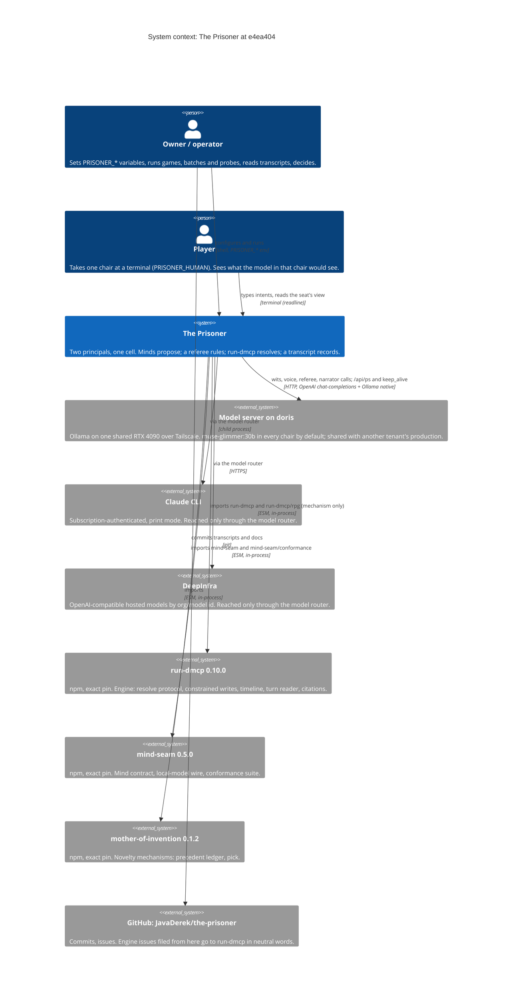
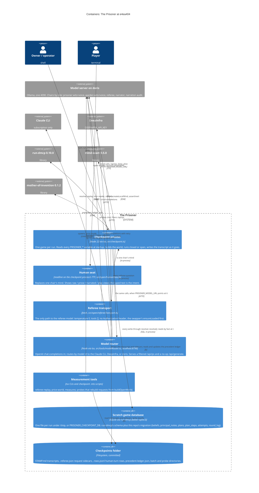
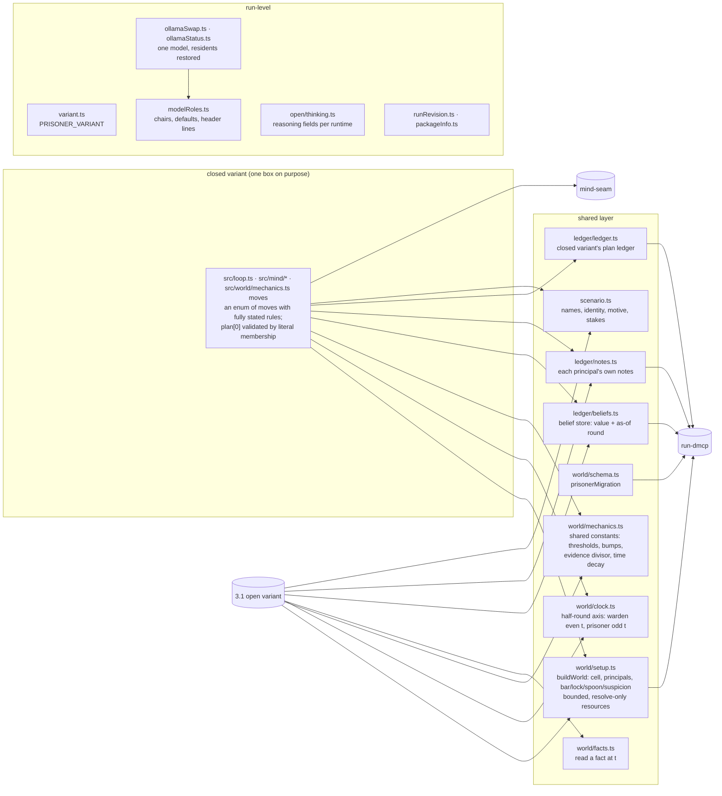
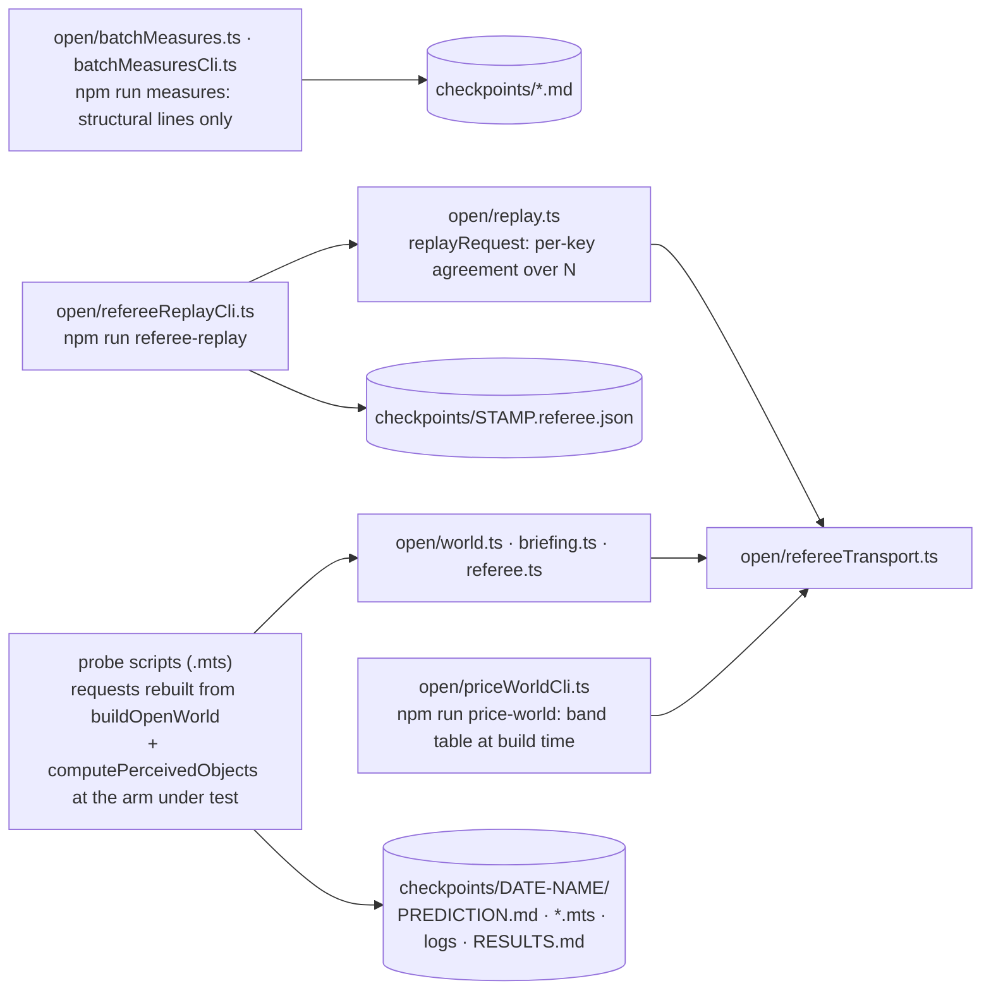

# The Prisoner architecture — C4 levels 1 to 3

This document describes The Prisoner with the [C4 model](https://c4model.com): the system in its
context (level 1), the containers it is made of (level 2), and the components inside the ones that
matter (level 3). Level 4, code, is deliberately not here — it changes faster than a document can
follow, and the tests named in [Boundaries that are enforced](#boundaries-that-are-enforced) are its
real record.

It was written against `main` at **`e4ea404`** (2026-09-27, with the playtest's decisions, their review
and the seat's D10 all landed) and the pinned dependencies **run-dmcp 0.10.0, mind-seam 0.5.0,
mother-of-invention 0.1.2**. Counts and names quoted here are pinned by tests where a test exists, and
each such count says which test. Where a statement is an inference rather than something the tree
states outright, it says so.

**This is not the design authority.** [DESIGN.md](DESIGN.md) is for the game and the closed variant,
[OPEN-VARIANT.md](OPEN-VARIANT.md) for the open variant, and section references of the form §80 point
into the latter unless they say otherwise. [../CLAUDE.md](../CLAUDE.md) holds the hard rules a change
must respect. This document only explains how the built thing is arranged so those three are easier
to read. Where it and they disagree, they win, and the disagreement belongs in
[Discrepancies found while writing this](#discrepancies-found-while-writing-this).

**The vocabulary rule runs the other way here.** run-dmcp and mind-seam describe this repository by
role ("two principals in one location, contending over the same physical state") and their guards
forbid its words. This repository is the game, so its words — prisoner, warden, cell, bar, spoon,
custody — are used freely below. What must not happen is those words reaching the other two
repositories, and the guards that stop it live there (see [Boundaries](#boundaries-that-are-enforced)).
Other repositories in `~/rpg` are named where this repository already names them.

The diagrams are Mermaid. Levels 1 and 2 use Mermaid's C4 notation; level 3 uses flowcharts, because
the C4 renderer does not lay out thirty components legibly. There are no presentation copies of these
diagrams yet; if some are made, they will rot faster than this file, and this file wins.

---

## Level 1 — System context

The Prisoner is **a two-principal game in one cell, played through run-dmcp's resolve protocol by
two model-driven minds (or one mind and a person), with a model referee ruling free-text intents.**
It is the resolve protocol's first production caller, the second consumer of mind-seam's mind
contract, and — the owner's standing framing — a harness for NPC-intelligence infrastructure: a fix
for bad reasoning here is made generically, so that it would help brink-workshop too, never as a
prisoner-only prompt hint.

It has no server of its own and no users besides the people running it. What it presents:

| Surface | What it is | Who uses it |
|---|---|---|
| **`npm run checkpoint`** | One game per run, closed or open variant, configured entirely by `PRISONER_*` environment variables. Writes a transcript and its sidecars to `checkpoints/`. | The owner and agents running games, batches and probes. |
| **The human seat** | The same process, with one chair (`PRISONER_HUMAN=prisoner\|warden`) read from a terminal instead of a model. Open variant only; refuses to start without a TTY. | A person playing. |
| **`npm run model-router`** | A separate local HTTP process that speaks OpenAI chat-completions and routes by model id: Claude CLI, DeepInfra, or doris. | A game or probe whose chair or referee is not on doris. |
| **Measurement tools** | `npm run referee-replay`, `npm run price-world`, `npm run measures`, and per-checkpoint probe scripts (`checkpoints/<date>-<name>/*.mts`). | Whoever scores a batch or runs a pre-registered probe. |
| **The evidence** | `checkpoints/`: every transcript unedited, every batch's `PREDICTION.md` (committed before its first call) and `RESULTS.md`. | Readers of OPEN-VARIANT.md; the owner. |

### What the context diagram is saying

- **Everything that decides is a model, and every model is outside.** There is no model in this
  repository and no vendor SDK: minds speak OpenAI chat-completions through mind-seam's
  `createLocalMind` (or, for the prose seat and the strategy step, a plain `fetch` to the same
  endpoint), and the referee through `src/open/refereeTransport.ts`. What is true is decided by
  run-dmcp's `resolver.resolve()` in this process, against this process's own database.
- **The engine is a library here, never a server.** Only the mechanism entries (`run-dmcp`,
  `run-dmcp/rpg`) are imported, never `run-dmcp/server` or `run-dmcp/rpg/server` (CLAUDE.md,
  "TypeScript only"). No MCP transport is involved at any point.
- **The GPU is shared, which shapes the whole runtime.** doris's 4090 fits one model. Every call goes
  through a one-model swapper that refuses to unload a model it was not told it may (CLAUDE.md, "Real
  games use one model at a time"), and a batch runs one driver at a time because two drivers make the
  referee non-deterministic (§75).
- **Nothing depends on this repository.** brink-workshop, run-dmcp and mind-seam learn from it through
  issues, the authoring guide and published versions, never through an import.

---

## Level 2 — Containers

A C4 container is a separately runnable or deployable thing. The Prisoner has two processes of its
own, one data store per game, one evidence store, and three linked libraries it does not own. Two
entries below are drawn as containers although they run inside the checkpoint process, because each
is the single path to something outside it and the rest of the design leans on that: the human seat
(the only path a person's text takes into a game) and the referee transport (the only path to the
referee model).

### The containers

| Container | Technology | Responsibility | Notes |
|---|---|---|---|
| **Checkpoint process** | `tsx src/checkpoint.ts` (`npm run checkpoint`) | Reads every variable once at module load (a bad value stops the run before any model call, even in a variant that never uses it); sets `DMCP_DB_PATH` to the scratch file and runs `initializeSchema({ migrations: [prisonerMigration] })`; checks `/api/ps` against the allowed roster (`assertNoForeignModel`); runs `main()` (closed) or `mainOpen()` (open); writes the transcript and restores any resident models on the way out. | The transcript header names every arm the run used, and `Code revision: <sha> (clean)` or says the tree was dirty (`src/runRevision.ts`). A person's game says so in its header and is never pooled with a model batch. |
| **Human seat** | `src/open/humanSeat.ts` with `proseView.ts`, `deltaView.ts`, `narrator.ts`, `narrationAudit.ts` | One chair's `OpenMind`: prints that chair's situation in the chosen view and returns the typed line as the intent. No-turn commands (`raw`, `say`, `plan`, `holding`, `desc`, `conditions`, `rules`, `me`, `known`, `help`) print or set things without taking a turn. Since D10 the player's own outcome is shown the moment the half-round ends. Under a person only, `reconsider` offers one retype when the referee's target fell to its safe default. | Needs a TTY (`assertSeatIsPlayable`), so it is the one real run not detached. The raw view is byte-identical to the model's prompt opening. |
| **Referee transport** | `createRefereeTransport` over `fetch` | Sends one reader request, returns parsed answers; a non-200 or unparseable reply is an empty answer list, never a throw, so a failure does nothing (§2 invariant 4). Calls the swapper's `ensureLoaded` first and sends the thinking fields the runtime honours (`src/open/thinking.ts`). | The same transport serves the base referee, the one-act reading, the first-act re-ruling (D7), the elaboration referee and every replay tool, so a replay rules with the referee a game would. |
| **Model router** | `tsx src/tools/modelRouterCli.ts` (`npm run model-router`) | `opus`/`sonnet`/`haiku` or any `claude-*` id to the keyless Claude CLI with `ANTHROPIC_API_KEY` and `ANTHROPIC_AUTH_TOKEN` deleted from the child's environment; any `org/model` id to DeepInfra with backoff; `SHIM_LOCAL_MODELS` to `SHIM_LOCAL_URL`; everything else to doris. Hides the resident referee from `/api/ps` so the swapper does not evict it for a call that never touches the GPU. | Started by hand in its own terminal before a batch that needs it. One JSON line per request on stdout, kept under the batch's `logs/`. |
| **Model server** | Ollama on doris (patched 0.34.4 + ollama#18687 since 2026-09-27) | Serves every local chair. The swapper (`src/ollamaSwap.ts`) makes sure only one model is loaded and never two calls overlap. | Not this repository's; the other tenant's production shares the resident `muse-glimmer:30b` and its two runner slots (CLAUDE.md, "Local play is all-Muse"). |
| **Scratch game database** | SQLite through run-dmcp | The engine's tables and timeline, plus this repository's migration (`src/world/schema.ts`): the belief store, notes, and the closed variant's plan ledger. | Never a default path (root CLAUDE.md hard rule 2). The unit suite sets `DMCP_DB_PATH=:memory:` in `src/test-setup.ts`. |
| **Checkpoints folder** | Committed files | The evidence store: every transcript unedited (bad runs included), the `.referee.json` sidecar that makes every ruling replayable, `.rows.jsonl` for a human seat's turns, `precedent-ledger.json` (read and appended when `PRISONER_PRECEDENT_LEDGER` names it), and one directory per batch or probe. | A batch's `PREDICTION.md` is committed before its first call; labels in `.rows.jsonl`, `RESULTS.md` and `PREDICTION.md` are never edited afterwards. |
| **Linked libraries** | npm, exact pins, no caret, never linked | run-dmcp: `createResolver`, the constraint registry, `replay`, `createTurnReader`, `sourceWords`. mind-seam: `Mind`, `createLocalMind`, `coerceProposal`, `assertInert`, the conformance suite. mother-of-invention: the precedent ledger and `pick`. | `src/packageInfo.ts` reads the pins from `package.json` for the transcript header rather than hard-coding them. |

---

## Level 3 — Components

The checkpoint process holds almost all of the code. It is drawn in four cuts, following the seams
the tests enforce rather than the directory listing:

1. **The open variant** — `src/open/`, the free-text game and everything it renders.
2. **The shared layer and the closed variant** — `src/world/`, `src/ledger/`, `src/mind/`, `src/loop.ts`
   and the run-level modules at the top of `src/`.
3. **Measurement tooling** — replay, pricing, batch measures, probes.
4. **The model router** — `src/tools/`.

The rule across 1 and 2 is CLAUDE.md's "Two variants, one switch": **everything except the action
layer is shared**, so a comparison between the variants means something. The open variant imports
from the shared layer (beliefs, notes, clock, world setup, the closed variant's constants); nothing in
the shared layer imports `src/open/`, except `src/world/mechanics.ts`'s own constants being read.

### 3.1 The open variant

One half-round, in order: the mind is asked; the referee rules its intent; code turns the ruling
into a plan; the plan is resolved through the engine; the outcome is rendered to the actor and,
where perceptible, to the other principal. Everything else hangs off that line.

```mermaid
flowchart TB
  subgraph run["round loop"]
    game["game.ts<br/>runOpenGame: warden then prisoner each round<br/>absence cadence (D5) · news inboxes · time decay"]
    loop["loop.ts<br/>runOpenHalfRound · describeAttempt<br/>suspicion · evidence · block lapse (D4')"]
    gameEnd["gameEnd.ts<br/>escape after every half · catch after the warden's reveal"]
  end

  subgraph action["action layer"]
    mind["mind.ts<br/>createOpenMind (wits + voice)<br/>prompt: conditions first, situation, rules"]
    passive["passiveWarden.ts · proseMind.ts<br/>alternative chairs"]
    referee["referee.ts<br/>createReferee: six cited questions<br/>one-act reading · first act (D7) · arms"]
    effects["effects.ts<br/>planEffect: ruling → mechanic + parameters<br/>13 effect keys + none"]
    mechanics["mechanics.ts<br/>OPEN_WEAR … OPEN_BLOCK, OPEN_MOVE<br/>buildOpenResolver"]
  end

  subgraph worldc["world and what each side knows"]
    world["world.ts<br/>buildOpenWorld: objects, exits, gates<br/>blocking / held_in / person resources"]
    scen["scenarioObjects.ts · derivedObjects.ts<br/>authored objects, persons, reading bands"]
    briefing["briefing.ts<br/>buildOpenContext · computePerceivedObjects<br/>presence · ownership at t"]
    conditions["conditions.ts · conditionList.ts<br/>the condition list, asserted against the world"]
    perception["perception.ts<br/>renderOwnOutcome · renderForOther"]
  end

  subgraph novelty["novelty and elaboration (arms)"]
    precedent["precedent.ts<br/>ledger of what the warden saw"]
    pick["pickCondition.ts<br/>mother-of-invention pick"]
    strategy["strategy.ts<br/>one committed approach before round 1"]
    elab["elaborationReferee.ts · elaborationBands.ts<br/>acquirableProperties.ts: OPEN_ACQUIRE"]
  end

  subgraph seatc["the human seat"]
    humanSeat["humanSeat.ts<br/>views, no-turn commands, reconsider"]
    views["proseView.ts · deltaView.ts<br/>prose from the same data; standing world once"]
    narr["narrator.ts · narrationAudit.ts<br/>model prose, verified, then audited"]
  end

  subgraph record["the record"]
    ctrans["checkpointTranscript.ts · transcript.ts<br/>per half-round text · measurements · fog audit"]
    report["turnReport.ts<br/>.rows.jsonl rows (personsInView since D12)"]
    rtransport["refereeTransport.ts · thinking.ts"]
  end

  engine[("run-dmcp<br/>resolver.resolve() · turn reader · replay")]
  seamlib[("mind-seam<br/>createLocalMind · assertInert")]
  moilib[("mother-of-invention")]
  shared[("3.2 shared layer<br/>beliefs · notes · clock · world setup")]

  game --> loop & gameEnd & briefing & perception
  loop --> mind & referee & effects & perception & precedent
  loop -->|"the only write"| engine
  loop --> elab
  loop --> pick
  mind --> seamlib
  humanSeat -.->|"is an OpenMind"| mind
  passive -.->|"is an OpenMind"| mind
  humanSeat --> views & narr
  referee --> rtransport
  referee --> engine
  effects --> scen
  mechanics --> engine
  world --> scen
  world --> shared
  briefing --> world & shared
  conditions --> world
  mind --> conditions
  precedent --> moilib
  pick --> moilib
  loop --> shared
  gameEnd --> world
  ctrans --> loop & perception
  report --> referee & perception
  strategy -.->|"one line in the prisoner's briefing"| game
```

| Component | Source | Responsibility |
|---|---|---|
| **Round loop** | `game.ts` | Warden then prisoner every round; builds each principal's context from its inbox; `checkOpenGameEnd` after every half; one time-decay resolution per round. Under `PRISONER_ABSENCE=cadence` it moves the warden to the corridor on every fourth round by an audited `OPEN_MOVE` and skips his half-round outright (§80.1, D5). The cadence's move out lapses his block first (`3e1c24a`). Its own parameter defaults stay the pre-2026-09-27 behaviour; `checkpoint.ts` passes the env readers' values. |
| **Half-round** | `loop.ts` | Mind → (pick, replan) → notes persisted → referee → (a person's one reconsider) → `planEffect` → perception decided before `resolve()` (D1) → block lapse (D4') → `resolve()` → the actor's belief from every transition (D8) → suspicion: a prisoner's act on the warden's own body gives grounds at once (to 40, then the magnitude bump, D13), otherwise the ordinary bump (present, able to see (D14), eligible, not silent, not on a person) → evidence bump on a warden's reveal. A refusal relays the same attempt sentence as a landed act. |
| **Referee** | `referee.ts` | Six closed questions (target, effect, product, property, magnitude, perceptibility), each answer cited verbatim against a named source (the intent, or a target's authored description), through run-dmcp's `createTurnReader`. Optional: the instrument question, the one-act reading and its first-act re-ruling, and clauses behind arms (elision, container, derive wording, derive repeat, block, person instrument). **The env reader's default is what a game gets; `createReferee`'s bare constructor default is the old request**, which is how the fingerprint PIN stays byte-identical. |
| **Plan** | `effects.ts` | Turns a ruling into one mechanic and its parameters, or `null` ("no invented world"). Thirteen effect keys plus `none` (`EFFECT_KINDS`; `attemptNotOutcome.test.ts` requires a scenario for every one but `none`). Gates (window on the bar, door on the lock under `margin`), custody's C1 gate, the close gate (D11), blockers for a leave (D4'). A gated way out with a key (`world.ts`'s `keyOf`: the door's is the key ring) hands `OPEN_PASSAGE` the key and the actor (D15). |
| **Mechanics** | `mechanics.ts` | Pure adjudicators handed facts, never a database: wear, restore, reveal (refuses blind, D12), conceal/expose (with the person-container pair), noise, passage open/close (the gate lifts for the key's holder, read from the key's own owner column at t, D15), leave, block, move, take, give, search, derive, acquire. Every `IntendedChange` goes through the engine's one choke point. |
| **World** | `world.ts`, `scenarioObjects.ts`, `derivedObjects.ts`, `acquirableProperties.ts` | `buildOpenWorld` declares the authored objects as bounded, resolve-only resources, the exits and their gates, one blocking resource per principal (always), each way out's key (`keyOf`, D15: the door's is the key ring; the window has none), and — under presence — each person's posture, sight and containment. Content lives in the scenario files; mechanism never names a scenario object. |
| **What each side knows** | `briefing.ts`, `conditions.ts`, `conditionList.ts`, `perception.ts` | The context a mind sees: perceived objects at `t` (presence and ownership read from facts), beliefs with their "as of round N" stamps, news, notes, plan, the rule lines (presence, absence), and the condition list read from its own side. `perception.ts` writes the actor's own outcome and what the other perceives, positively (§2 invariant 7). |
| **Minds** | `mind.ts`, `proseMind.ts`, `passiveWarden.ts` | `createOpenMind` composes a wits call (the intent, thoughts, notes, plan, candidates) and a voice call (one spoken line that never reaches the referee), through mind-seam. The prose seat asks one question; the passive warden attempts nothing. |
| **Novelty and elaboration** | `precedent.ts`, `pickCondition.ts`, `strategy.ts`, `elaborationReferee.ts`, `elaborationBands.ts` | Arms, each off by default: what the warden has seen before (and its price), forcing the prisoner off a known approach, one committed strategy line, and the world acquiring a declared property at a pre-priced band. |
| **Human seat** | `humanSeat.ts`, `proseView.ts`, `deltaView.ts`, `narrator.ts`, `narrationAudit.ts` | How a person sees the same data: raw (the prompt, byte for byte), prose (composed by code), narrated (a model's prose, verified, then audited sentence by sentence), play (news first, standing blocks behind commands). D10 (§80.1): the stakes are a block shown once and again in the last five rounds; beliefs are one item each, held back when unchanged and printed whole by `known`; a belief whose property has readings is shown as the words last read; the player's own outcome is notified at once and its byte-equal news line dropped from `play`. The-prisoner#32 (§81): D5's absence-cadence rule line is recognised the same way as the stakes line (an exact match against `briefing.ts`'s own `absenceRuleLine`) and given its own `absence` block, STANDING and reachable under `rules` -- it used to ride along inside `news` and repeat every turn. None of it reaches a model prompt; `PLAY_BLOCK_POLICY` is a `Record` over every block kind, so a new kind cannot reach the player undecided. |
| **Record** | `checkpointTranscript.ts`, `transcript.ts`, `turnReport.ts`, `runAbandon.ts` | The per-half-round transcript text, both rulings where two were made (reconsider, first act), §5.2's measurements, the fog audit, the replayable request sidecar, the human-turn rows, and what a game keeps when the player walks away. |

### 3.2 The shared layer, and the closed variant beside it

| Component | Source | Responsibility |
|---|---|---|
| **Closed variant** | `src/loop.ts`, `src/mind/`, `src/world/mechanics.ts`, `src/world/revelations.ts`, `src/view/viewFor.ts`, `src/witsSummary.ts` | The original game: each mind picks `plan[0]` from an enum, validated by literal membership in a list this repository wrote. None of the 2026-09-27 changes touch it; it is drawn as one box because its internals are DESIGN.md's to describe and have not moved in weeks. |
| **World setup and clock** | `src/world/setup.ts`, `clock.ts` | The cell, both principals and the base resources, created through run-dmcp's library calls; the half-round `t` axis both variants play on. |
| **Shared constants** | `src/world/mechanics.ts` | The thresholds and bumps both variants' prompts state (suspicion threshold 40, the evidence divisor, the magnitude bumps, time decay). The open variant imports them and never redeclares them. |
| **Belief store and notes** | `src/ledger/beliefs.ts`, `notes.ts` | What each principal believes, with the round it learned it, and its own notes. Written only by the loop from resolved outcomes and seeded truths, never by a mind. |
| **Plan ledger** | `src/ledger/ledger.ts` | The closed variant's plans, steps, attempts and round log. |
| **Model roles and the swapper** | `src/modelRoles.ts`, `src/ollamaSwap.ts`, `src/ollamaStatus.ts` | Which model sits in which chair (default `muse-glimmer:30b` everywhere), the header lines that name them, and the one-model discipline on doris: unload before load, never overlap, stop on a foreign model, restore residents. |
| **Thinking** | `src/open/thinking.ts` | Per-role reasoning control and the fields the current runtime honours (`reasoning_effort` and the `<\|eot\|>` stop on Ollama). Lives under `open/` but the closed variant's header reads it too. |

### 3.3 Measurement tooling

- **A replay re-asks a recorded request; a probe rebuilds one.** `referee-replay` measures the
  referee's consistency on the exact bytes a game sent. A probe that asks a *new* question must build
  its request from `buildOpenWorld` and `computePerceivedObjects` at the arm it measures, never from a
  recorded request (wrong arm) or a copied harness (wrong instrument mode) — the measurement-fidelity
  rule, learned twice.
- **`batchMeasures` never reads prose.** Every number comes from structural transcript lines this
  repository writes.
- **Probe scripts are not under `src/`.** They live beside the evidence they produce, import `src/`
  directly, and are not typechecked or tested by `npm test`. They are committed with the batch.

### 3.4 The model router

`src/tools/modelRouter.ts` is one module with a `selectRoute(model)` rule, four upstreams (Claude
CLI, DeepInfra, a second local runtime, doris), per-attempt timeouts with one retry on doris and
backoff on DeepInfra, the filtered `/api/ps` and the no-op `/api/generate`. It touches no storage
and belongs to neither the engine nor the seam, which is why it lives here. `modelRouter.test.ts`
pins the routing rule and the child environment.

---

## Boundaries that are enforced

The architecture above is not a convention. Each line in it that matters has a test that goes red
when it is crossed, and the test is the durable record; this document is the map to it.

| Boundary | Test | What goes red |
|---|---|---|
| OPEN-VARIANT §2's seven invariants: no write outside the resolve protocol (a source scan for write-capable tokens in the referee and minds, with a planted violation); a mind never learns what it could not perceive; no effect without both verified citations; a referee failure does nothing; a ruling cannot touch the other's beliefs, notes or choice; no object outside the scenario; no rendered outcome states an absence | `src/open/__tests__/invariants.test.ts` | Names the invariant; each block has its planted violation |
| The other side is told the attempt, never the outcome: for every effect key but `none`, a landed and a failed half-round relay the identical sentence; every text in `checkpoints/precedent-ledger.json` is producible by `precedentTextFor` | `src/open/__tests__/attemptNotOutcome.test.ts` | The kind whose two sentences differ, or the ledger text no code writes |
| The base referee request is byte-identical to what recorded batches were asked: the six question ids and a SHA-256 of the questions, taken with objects only in view. Every change to it is dated "changed on purpose" in the test | `src/open/__tests__/referee.test.ts` ("PIN: the base referee request's own six questions…") | The hash |
| The human seat's raw view is the model's own prompt opening, byte for byte | `src/open/__tests__/humanSeat.test.ts` ("shows the player the situation the model's OWN prompt opens with, byte for byte") | A view that drifted from the prompt |
| RED-TEAM §2's contest lines play out under the defaults as the env readers return them (Line B escapes at 21 below grounds; Line A is caught at 6; a block is an occupation; D11 removes the open–close loop on both ways out, the key's holder included (D15 lifts the open gate only); the blind line, where nothing accrues while he is blind (D14) and covering him gives grounds (D13); the key ring opens the door for whoever holds it (D15)) | `src/open/__tests__/contestLines.test.ts` | The line whose outcome moved, with the round |
| Every condition states only what the world enforces: the door's stated gate is the exit's own `openWhenPartAtMost`; the block and restore conditions use the mechanic's own lines; the key conditions name the world's own `keyOf` (D15) | `src/open/__tests__/conditions.test.ts` ("says nothing the world does not do"), `block.test.ts` ("asserted against the world") | A condition that has become a lie |
| The model header is byte-identical to recorded batches when both chairs agree, and names both chairs when they differ | `src/__tests__/modelRoles.test.ts` | A header a reader could pool wrongly |
| The closed minds pass mind-seam's conformance suite, including the planted-marker fog check | `src/mind/__tests__/seamConformance.prisoner.test.ts`, `seamConformance.warden.test.ts` | The suite's own check |
| Contexts are inert records: tsc refuses a writable field; `assertInert` catches a getter tsc cannot | `src/mind/__tests__/types.test.ts` | Compile error, or the runtime check |
| The other principal's notes and thoughts never reach a context or a request body | `src/mind/__tests__/privateFields.test.ts`, `rolesFog.test.ts`, `crossPerception.test.ts` | The planted marker's location |
| The transcript names its revision and says when the tree was dirty | `src/__tests__/runRevision.test.ts` | A dirty tree reported clean |
| The router never runs the Claude CLI with a metered key in its environment | `src/tools/__tests__/modelRouter.test.ts` ("deletes ANTHROPIC_API_KEY and ANTHROPIC_AUTH_TOKEN…") | The key reaching the child |
| **Vocabulary: this game's words never reach the engine or the seam** | **Not in this repository.** `run-dmcp/src/__tests__/engineVocabulary.test.ts` (extended to this game's principals at run-dmcp `e008cb5`) and `mind-seam/src/__tests__/vocabulary.test.ts` | A file in those trees naming a warden or a prisoner |
| No test touches a file on disk | `src/test-setup.ts` sets `DMCP_DB_PATH=:memory:` process-wide | (a setup, not an assertion) |

The playtest's own decisions each have a dedicated file beside these: `block.test.ts` (D4'),
`closeGate.test.ts` (D11), `sight.test.ts` (D12, and D14's gate), `absence.test.ts` (D5); D10's are in
`proseView.test.ts`, `deltaView.test.ts` and `humanSeat.test.ts`. The owner's answers to §80's open decisions
(OPEN-VARIANT.md §80.7): `layingHands.test.ts` (D13), `keyRing.test.ts` (D15), and D16's two pins in
`attemptNotOutcome.test.ts`. As of `e4ea404`, `npx vitest run`
counts 84 files and 1422 tests; that count is a snapshot, not pinned.

---

## Configuration reference

Every variable below is read by `src/checkpoint.ts` at startup unless noted, through a reader that
throws on an unrecognised value unless noted. **Defaults are as of `e4ea404` (2026-09-27).** A
library function's own default (`buildOpenWorld`, `openConditions`, `runOpenGame`, `createReferee`)
is often the *old* behaviour on purpose, so that unit tests and replays stay byte-identical; the
column below is what a real game gets.

### Run, models and runtime

| Variable | Default | Values and effect |
|---|---|---|
| `PRISONER_VARIANT` | `closed` | `closed` \| `open` (`src/variant.ts`). |
| `PRISONER_ROUNDS` | `12` | Total rounds. Not validated beyond `Number()`. |
| `PRISONER_CHECKPOINT_DB` | `/tmp/the-prisoner-checkpoint-<ms>.db` | The scratch database. `checkpoint.ts` then sets `DMCP_DB_PATH` to it, overriding any value in the shell. |
| `PRISONER_MODEL_URL` | `http://localhost:11434/v1` | OpenAI-compatible base for every chair and the referee (also read by `referee-replay` and `price-world`). Point it at doris or at the model router. |
| `PRISONER_OLLAMA_NATIVE_URL` | the model URL minus `/v1` | Where `/api/ps` and `/api/generate` live. |
| `PRISONER_OLLAMA_RESIDENT_MODELS` | empty | Comma list the run may find loaded, unload, and must restore. Any other loaded model stops the run. |
| `PRISONER_MODEL` | unset | Sets wits and voice together. |
| `PRISONER_WITS_MODEL` / `PRISONER_VOICE_MODEL` | `PRISONER_MODEL`, else `muse-glimmer:30b` | The run's pair. |
| `PRISONER_SKIP_VOICE` | unset | `1` collapses voice onto the wits model. |
| `PRISONER_PRISONER_MODEL` / `PRISONER_WARDEN_MODEL` | unset (the run's pair) | One chair's whole mind, wits and voice. |
| `PRISONER_REFEREE_MODEL` | `muse-glimmer:30b` | Empty is unset. |
| `PRISONER_THINK_TIMEOUT_MS` | unset (mind-seam's 12 s; the strategy step's own 300 s) | Mind calls. |
| `PRISONER_REFEREE_TIMEOUT_MS` | `PRISONER_THINK_TIMEOUT_MS`, else the transport's 12 s | Referee calls. |
| `PRISONER_REFEREE_THINKING` / `PRISONER_WITS_THINKING` | `off` | `on` \| `off`, per role. |
| `PRISONER_THINKING` | unset | Legacy override for both roles when the per-role variable is unset. |
| `PRISONER_HUMAN` | unset (two models) | `prisoner` \| `warden`: a person in that chair. Open only; needs a TTY. |
| `PRISONER_VIEW` | `raw` | `raw` \| `prose` \| `narrated` \| `play`. How the seat is shown, never what. |
| `PRISONER_NARRATOR_MODEL` | the voice model | Under `narrated` only. |
| `PRISONER_NARRATION_AUDIT` | on | `off` turns the second verifier off. **Any other value means on; this one does not throw.** |
| `PRISONER_NARRATION_AUDIT_MODEL` | the referee model | Empty is unset. |
| `PRISONER_PROSE_SEAT` | unset | `prisoner` \| `warden`: that chair is asked one question, its answer taken whole. |
| `PRISONER_WARDEN` | unset (the model warden) | `passive`: the warden attempts nothing. |

### The open variant's arms

The first eight rows are the 2026-09-27 boundary (OPEN-VARIANT §80.2); the arm in the last column
restores the 2026-09-26 game.

| Variable | Default | Arms | Since / section |
|---|---|---|---|
| `PRISONER_PRESENCE` | `modelled` | `off` | default since 2026-09-27 (D2); §55 |
| `PRISONER_ABSENCE` | `cadence` | `off` (and required with presence `off`) | new 2026-09-27 (D5) |
| `PRISONER_CONDITIONS` | `both` | `list` (2026-09-17..27), `off` (before) | default since 2026-09-27 (D3); §34, §40 |
| `PRISONER_DOOR` | `stated` | `unstated` | default since 2026-09-27 (D6'); §46 |
| `PRISONER_DOOR_PRICE` | `margin` | `free`, `threshold` | default since 2026-09-27 (D6'); §50 |
| `PRISONER_BLOCK` | `on` | `off` | new 2026-09-27 (D4', D4b) |
| `PRISONER_ONE_ACT` | `first` | `checked` (2026-09-22..27), `off` (before) | default since 2026-09-27 (D7); §74.1 |
| `PRISONER_PERSON_INSTRUMENT` | `off` | `on` | new 2026-09-27 (D12), off pending P3 |
| `PRISONER_ELISION` | `on` | `off` | default since 2026-09-26; §77 |
| `PRISONER_CONTAINER_CLAUSE` | `on` | `off` | default since 2026-09-26; §79 |
| `PRISONER_DERIVE_REPEAT` | `off` | `on` | held off by the owner, 2026-09-26; §79 |
| `PRISONER_DERIVE_WORDING` | `baseline` | `sharpened` | §51 |
| `PRISONER_INSTRUMENT` | `off` | `checked` | §51 |
| `PRISONER_WINDOW` | `open` | `welded` | §64.3 |
| `PRISONER_ELABORATE` | `off` | `property` | WORLD-ELABORATION-DESIGN §4 |
| `PRISONER_ELABORATE_BAND` | unset (the built table) | `trivial`, `hard`, `ruinous`, `impossible` | the §4.8 sweep only |
| `PRISONER_PRECEDENT_LEDGER` | unset | a JSON file path (created if absent) | §11 |
| `PRISONER_PRECEDENT_PRICE` | `flat` | `stale` | §42 |
| `PRISONER_PICK` | unset | `even`, `even-regenerate`, `replan` | §21, §23, §36 |
| `PRISONER_STRATEGY` | `off` | `fixed`; `revise` parses and is refused at startup | STRATEGY-DESIGN |
| `PRISONER_STRATEGY_STRENGTH` | `high` | `none`, `low`, `medium` | STRATEGY-DESIGN §3.2 |

### The model router

Read by `src/tools/modelRouter.ts`, none of them validated beyond `Number()`.

| Variable | Default |
|---|---|
| `SHIM_PORT` / `SHIM_HOST` | `8799` / `127.0.0.1` |
| `SHIM_DORIS` | `http://doris:11434` |
| `SHIM_HIDE_MODELS` | `DEFAULT_REFEREE_MODEL` (`muse-glimmer:30b`) |
| `SHIM_LOCAL_URL` / `SHIM_LOCAL_MODELS` | empty (no local route) |
| `SHIM_CLAUDE_CWD` | the router's cwd |
| `SHIM_CLAUDE_TIMEOUT_MS` | `280000` |
| `SHIM_DORIS_ATTEMPT_TIMEOUT_MS` | `150000` |
| `SHIM_DEEPINFRA_ATTEMPT_TIMEOUT_MS` | `120000` |
| `SHIM_DUMP_DIR` | empty (no request dumps) |
| `DEEPINFRA_API_KEY` | empty |

---

## Discrepancies found while writing this

Each is a statement in one place that the place the fact lives contradicts. None was fixed in the
commit that added this document, except the CLAUDE.md custody paragraph (item 6), which that
file's own update in the next commit corrects.

1. **`readContainerClauseMode`'s error message calls `off` the default.** The reader has returned
   `on` since 2026-09-26 (`src/open/referee.ts`); the message says `"on" or "off" (the default)`.
2. **The thinking parser's error message says `"on" (the default)`**, and `readThinkingMode("")` still
   returns `on`, while both roles have defaulted to `off` since 2026-09-25 (`src/open/thinking.ts`).
   `readThinkingMode` is called only by its own test.
3. **`PRISONER_DERIVE_REPEAT` is described as "NOT YET MEASURED"** in `referee.ts`'s docstring,
   `checkpoint.ts`'s comment and the `on` header line. §79 records it measured
   (`checkpoints/2026-09-26-derive-arm/RESULTS.md`) and held off by the owner's decision.
4. **`game.ts`'s header comment** still says presence is off "unless `PRISONER_PRESENCE=modelled`".
   That is `runOpenGame`'s own parameter default; the game's default has been `modelled` since
   2026-09-27 (the function's parameter docstring is correct).
5. **`PRISONER_NARRATION_AUDIT` is the one switch that does not throw** on an unrecognised value: it is
   read as `!== "off"`, so a typo leaves the audit on silently.
6. **CLAUDE.md's "Custody is not built"** has been false since `docs/CUSTODY-DESIGN.md` landed:
   `take`, `give` and a search (`expose` on a person) move an item's owner through a `set` in
   `resolve()`; the paragraph also names the old pin (0.8.0, now 0.10.0) and "eleven fixed effects"
   (now thirteen plus `none`). Corrected in CLAUDE.md in the commit after this one.
7. **CLAUDE.md's "The mind cannot write"** says the conformance suite's check 2 catches a cast past
   tsc. The suite runs over the closed variant's minds only
   (`src/mind/__tests__/seamConformance.*.test.ts`); the open minds are held by the same `Mind<C extends
   InertRecord>` type, by `createLocalMind`'s own `assertInert`, and by `invariants.test.ts`, but no
   test runs mind-seam's suite over them. A gap in coverage, not a known leak.
8. **The warden's pronoun differs by author.** The scenario refers to Croft as "they"
   (`PRISONER_MOTIVE`), the playtest documents as "he", and the new block condition and the sight
   readings as "her" ("Warden Croft is on her feet", "Something covers her head" for either person).
   The condition line reaches both chairs' prompts.
9. **README.md is behind the tree** in ways this document does not change: it calls the open variant
   "in design", counts thirty-six transcripts on three models, and its run example pins
   `PRISONER_MODEL=qwen3:14b` on the closed variant, which CLAUDE.md's "a worked example that pins a
   configurable is a second, mute copy of a decision" warns against. It states no default that
   changed on 2026-09-27.
10. **Two tests read a library default as if it were the game's.** `conditions.test.ts`'s "is absent
    unless asked for, so every earlier batch stays the comparison it was" is true of
    `openConditions()`'s bare default and not of a real game, which has stated the door since
    2026-09-27. The assertion is right; the title now reads as a claim about the game.

---

## Maintaining this document

- It is level 1 to 3 only. Do not add function signatures, line numbers or per-question prompt text;
  those rot, and the tests above are their record.
- When a `PRISONER_*` default changes, change the configuration table in the same commit, name the arm
  that restores the old behaviour, and add a line to OPEN-VARIANT.md for the batch boundary.
- When a new boundary test lands, add a row to [Boundaries that are enforced](#boundaries-that-are-enforced).
- When a count quoted here changes and a test pins it, say which test.
